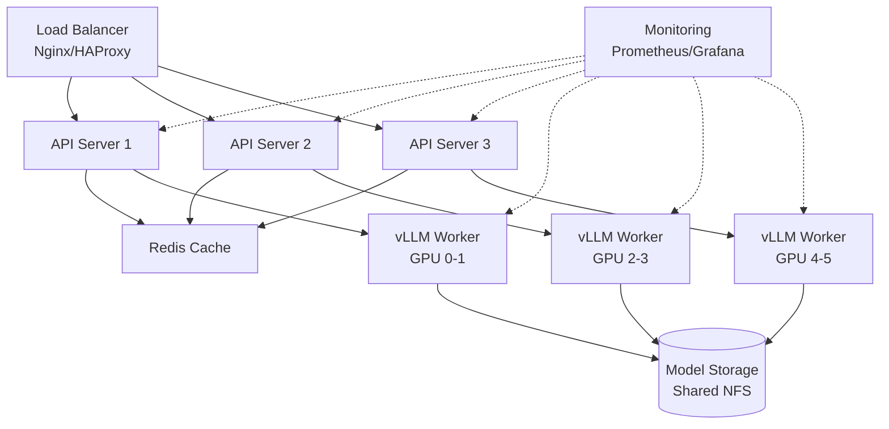

This guide covers best practices, optimization strategies, and production considerations for deploying Qwen models at scale.

## Architecture Design

### Deployment Architecture



### Recommended Stack

<CardGroup cols={2}>
  <Card title="Inference Engine" icon="rocket">
    **vLLM** for production workloads
    - High throughput
    - Memory efficient
    - Multi-GPU support
  </Card>
  
  <Card title="Orchestration" icon="server">
    **FastChat** for management
    - Model routing
    - Load balancing
    - Web UI optional
  </Card>
  
  <Card title="Reverse Proxy" icon="network-wired">
    **Nginx** or **Traefik**
    - SSL termination
    - Rate limiting
    - Request routing
  </Card>
  
  <Card title="Monitoring" icon="chart-line">
    **Prometheus + Grafana**
    - Metrics collection
    - Alerting
    - Visualization
  </Card>
</CardGroup>

## Performance Optimization

### Model Selection

<AccordionGroup>
  <Accordion title="Choose the Right Model Size">
    Select based on latency and throughput requirements:
    
    | Model | Use Case | Latency | Quality |
    |-------|----------|---------|--------|
    | Qwen-1.8B | High-throughput, simple tasks | ~50ms | Good |
    | Qwen-7B | Balanced performance | ~100ms | Excellent |
    | Qwen-14B | Complex reasoning | ~150ms | Superior |
    | Qwen-72B | Mission-critical, highest quality | ~400ms | Best |
  </Accordion>

  <Accordion title="Quantization Strategy">
    Use quantization to reduce memory and improve throughput:
    
    ```python
    # Int4 quantization (recommended)
    model = "Qwen/Qwen-7B-Chat-Int4"
    # 70% memory reduction, minimal quality loss
    
    # Int8 quantization
    model = "Qwen/Qwen-7B-Chat-Int8"
    # 40% memory reduction, negligible quality loss
    ```
    
    **Quality Comparison** (MMLU scores):
    - BF16: 55.8
    - Int8: 55.4 (-0.4)
    - Int4: 55.1 (-0.7)
  </Accordion>

  <Accordion title="Context Length Optimization">
    Set appropriate `max_model_len` based on use case:
    
    ```bash
    # Short conversations (most use cases)
    --max-model-len 4096
    
    # Long documents
    --max-model-len 8192
    
    # Extended context (requires more memory)
    --max-model-len 16384
    ```
    
    <Warning>
    Longer context increases memory usage linearly.
    </Warning>
  </Accordion>
</AccordionGroup>

### vLLM Configuration

<CodeGroup>
```bash High Throughput
python -m vllm.entrypoints.openai.api_server \
  --model Qwen/Qwen-7B-Chat-Int4 \
  --trust-remote-code \
  --dtype float16 \
  --max-model-len 4096 \
  --max-num-seqs 512 \
  --gpu-memory-utilization 0.95 \
  --disable-log-requests \
  --tensor-parallel-size 1
```

```bash Low Latency
python -m vllm.entrypoints.openai.api_server \
  --model Qwen/Qwen-7B-Chat \
  --trust-remote-code \
  --dtype bfloat16 \
  --max-model-len 2048 \
  --max-num-seqs 16 \
  --max-num-batched-tokens 4096 \
  --gpu-memory-utilization 0.90
```

```bash Memory Optimized
python -m vllm.entrypoints.openai.api_server \
  --model Qwen/Qwen-14B-Chat-Int4 \
  --trust-remote-code \
  --dtype float16 \
  --max-model-len 4096 \
  --gpu-memory-utilization 0.85 \
  --swap-space 8 \
  --tensor-parallel-size 2
```

```bash Balanced
python -m vllm.entrypoints.openai.api_server \
  --model Qwen/Qwen-7B-Chat \
  --trust-remote-code \
  --dtype bfloat16 \
  --max-model-len 4096 \
  --max-num-seqs 128 \
  --gpu-memory-utilization 0.92 \
  --tensor-parallel-size 1
```
</CodeGroup>

### Multi-GPU Strategies

<Tabs>
  <Tab title="Tensor Parallelism">
    Split single model across GPUs:
    ```bash
    # Best for large models (72B)
    python -m vllm.entrypoints.openai.api_server \
      --model Qwen/Qwen-72B-Chat \
      --trust-remote-code \
      --tensor-parallel-size 4 \
      --dtype bfloat16
    ```
    
    **Pros**: Higher throughput per model
    **Cons**: All GPUs serve single model
  </Tab>
  
  <Tab title="Model Replication">
    Run separate instances:
    ```bash
    # GPU 0
    CUDA_VISIBLE_DEVICES=0 python -m vllm... --port 8000
    
    # GPU 1
    CUDA_VISIBLE_DEVICES=1 python -m vllm... --port 8001
    
    # GPU 2
    CUDA_VISIBLE_DEVICES=2 python -m vllm... --port 8002
    ```
    
    **Pros**: Independent failure domains
    **Cons**: Requires load balancer
  </Tab>
  
  <Tab title="Hybrid Approach">
    Combine both strategies:
    ```bash
    # Pair 1: GPUs 0-1
    CUDA_VISIBLE_DEVICES=0,1 python -m vllm... \
      --tensor-parallel-size 2 --port 8000
    
    # Pair 2: GPUs 2-3
    CUDA_VISIBLE_DEVICES=2,3 python -m vllm... \
      --tensor-parallel-size 2 --port 8001
    ```
    
    **Pros**: Balanced throughput and redundancy
    **Recommended** for 4+ GPU systems
  </Tab>
</Tabs>

## Security

### Authentication

<Tabs>
  <Tab title="API Key Authentication">
    ```python
    from fastapi import Security, HTTPException
    from fastapi.security import APIKeyHeader
    
    API_KEYS = {"sk-key1", "sk-key2", "sk-key3"}
    api_key_header = APIKeyHeader(name="X-API-Key")
    
    async def verify_api_key(api_key: str = Security(api_key_header)):
        if api_key not in API_KEYS:
            raise HTTPException(status_code=403, detail="Invalid API key")
        return api_key
    
    @app.post("/v1/chat/completions", dependencies=[Depends(verify_api_key)])
    async def chat_completion(request: ChatRequest):
        # Your endpoint logic
        pass
    ```
  </Tab>
  
  <Tab title="JWT Authentication">
    ```python
    from fastapi import Depends, HTTPException
    from fastapi.security import HTTPBearer
    import jwt
    
    security = HTTPBearer()
    SECRET_KEY = "your-secret-key"
    
    async def verify_token(credentials = Security(security)):
        token = credentials.credentials
        try:
            payload = jwt.decode(token, SECRET_KEY, algorithms=["HS256"])
            return payload
        except jwt.InvalidTokenError:
            raise HTTPException(status_code=401, detail="Invalid token")
    
    @app.post("/v1/chat/completions", dependencies=[Depends(verify_token)])
    async def chat_completion(request: ChatRequest):
        pass
    ```
  </Tab>
  
  <Tab title="OAuth2">
    ```python
    from fastapi import Depends
    from fastapi.security import OAuth2PasswordBearer
    import httpx
    
    oauth2_scheme = OAuth2PasswordBearer(tokenUrl="token")
    
    async def verify_oauth_token(token: str = Depends(oauth2_scheme)):
        # Verify with OAuth provider
        async with httpx.AsyncClient() as client:
            response = await client.get(
                "https://oauth-provider.com/verify",
                headers={"Authorization": f"Bearer {token}"}
            )
            if response.status_code != 200:
                raise HTTPException(status_code=401, detail="Invalid token")
            return response.json()
    ```
  </Tab>
</Tabs>

### SSL/TLS Configuration

Nginx SSL configuration:

```nginx
server {
    listen 443 ssl http2;
    server_name api.example.com;
    
    # SSL certificates
    ssl_certificate /etc/ssl/certs/api.example.com.crt;
    ssl_certificate_key /etc/ssl/private/api.example.com.key;
    
    # SSL configuration
    ssl_protocols TLSv1.2 TLSv1.3;
    ssl_ciphers HIGH:!aNULL:!MD5;
    ssl_prefer_server_ciphers on;
    
    # Security headers
    add_header Strict-Transport-Security "max-age=31536000" always;
    add_header X-Frame-Options "DENY" always;
    add_header X-Content-Type-Options "nosniff" always;
    
    location / {
        proxy_pass http://localhost:8000;
        proxy_set_header Host $host;
        proxy_set_header X-Real-IP $remote_addr;
        proxy_set_header X-Forwarded-For $proxy_add_x_forwarded_for;
        proxy_set_header X-Forwarded-Proto $scheme;
    }
}
```

### Rate Limiting

<CodeGroup>
```python FastAPI Rate Limiting
from fastapi import Request
from slowapi import Limiter, _rate_limit_exceeded_handler
from slowapi.util import get_remote_address
from slowapi.errors import RateLimitExceeded

limiter = Limiter(key_func=get_remote_address)
app.state.limiter = limiter
app.add_exception_handler(RateLimitExceeded, _rate_limit_exceeded_handler)

@app.post("/v1/chat/completions")
@limiter.limit("100/minute")
async def chat_completion(request: Request):
    # Your endpoint logic
    pass
```

```nginx Nginx Rate Limiting
http {
    limit_req_zone $binary_remote_addr zone=api_limit:10m rate=10r/s;
    
    server {
        location /v1/chat/completions {
            limit_req zone=api_limit burst=20 nodelay;
            proxy_pass http://localhost:8000;
        }
    }
}
```

```python Redis-based Limiting
import redis
from datetime import datetime, timedelta

redis_client = redis.Redis(host='localhost', port=6379)

async def check_rate_limit(user_id: str, limit: int = 100):
    key = f"rate_limit:{user_id}:{datetime.utcnow().strftime('%Y%m%d%H%M')}"
    count = redis_client.incr(key)
    
    if count == 1:
        redis_client.expire(key, 60)
    
    if count > limit:
        raise HTTPException(status_code=429, detail="Rate limit exceeded")
```
</CodeGroup>

## Monitoring & Observability

### Prometheus Metrics

Expose metrics for monitoring:

```python
from prometheus_client import Counter, Histogram, Gauge, make_asgi_app
import time

# Define metrics
request_count = Counter(
    'qwen_requests_total',
    'Total requests',
    ['model', 'status']
)

request_duration = Histogram(
    'qwen_request_duration_seconds',
    'Request duration',
    ['model']
)

active_requests = Gauge(
    'qwen_active_requests',
    'Active requests',
    ['model']
)

tokens_generated = Counter(
    'qwen_tokens_generated_total',
    'Total tokens generated',
    ['model']
)

# Add metrics endpoint
metrics_app = make_asgi_app()
app.mount("/metrics", metrics_app)

@app.post("/v1/chat/completions")
async def chat_completion(request: ChatRequest):
    start_time = time.time()
    active_requests.labels(model=request.model).inc()
    
    try:
        response = await generate_response(request)
        request_count.labels(model=request.model, status="success").inc()
        tokens_generated.labels(model=request.model).inc(response.usage.completion_tokens)
        return response
    except Exception as e:
        request_count.labels(model=request.model, status="error").inc()
        raise
    finally:
        duration = time.time() - start_time
        request_duration.labels(model=request.model).observe(duration)
        active_requests.labels(model=request.model).dec()
```

### Grafana Dashboard

Key metrics to monitor:

<CardGroup cols={2}>
  <Card title="Throughput" icon="gauge-high">
    - Requests per second
    - Tokens per second
    - Batch size utilization
  </Card>
  
  <Card title="Latency" icon="clock">
    - p50, p95, p99 response times
    - Time to first token (TTFT)
    - Inter-token latency
  </Card>
  
  <Card title="Resources" icon="server">
    - GPU utilization
    - GPU memory usage
    - CPU and system memory
  </Card>
  
  <Card title="Errors" icon="triangle-exclamation">
    - Error rate
    - Timeout rate
    - Queue depth
  </Card>
</CardGroup>

### Health Checks

Implement comprehensive health checks:

```python
from fastapi import status
import psutil
import torch

@app.get("/health")
async def health_check():
    return {"status": "healthy"}

@app.get("/health/detailed")
async def detailed_health_check():
    # Check GPU
    gpu_available = torch.cuda.is_available()
    if gpu_available:
        gpu_memory = torch.cuda.get_device_properties(0).total_memory
        gpu_memory_used = torch.cuda.memory_allocated(0)
        gpu_utilization = (gpu_memory_used / gpu_memory) * 100
    else:
        gpu_utilization = None
    
    # Check system resources
    cpu_percent = psutil.cpu_percent(interval=1)
    memory = psutil.virtual_memory()
    
    # Check model
    model_loaded = model is not None
    
    health_status = {
        "status": "healthy" if model_loaded and gpu_available else "degraded",
        "model_loaded": model_loaded,
        "gpu": {
            "available": gpu_available,
            "utilization": gpu_utilization,
        },
        "system": {
            "cpu_percent": cpu_percent,
            "memory_percent": memory.percent,
            "memory_available_gb": memory.available / (1024**3)
        },
        "timestamp": datetime.utcnow().isoformat()
    }
    
    if health_status["status"] == "degraded":
        return JSONResponse(
            status_code=status.HTTP_503_SERVICE_UNAVAILABLE,
            content=health_status
        )
    
    return health_status
```

## Scaling Strategies

### Horizontal Scaling

<Steps>
  <Step title="Load Balancer Setup">
    Configure Nginx for multiple backends:
    ```nginx
    upstream qwen_backend {
        least_conn;  # Use least connections algorithm
        server 10.0.1.10:8000 max_fails=3 fail_timeout=30s;
        server 10.0.1.11:8000 max_fails=3 fail_timeout=30s;
        server 10.0.1.12:8000 max_fails=3 fail_timeout=30s;
    }
    
    server {
        location / {
            proxy_pass http://qwen_backend;
            proxy_next_upstream error timeout http_502 http_503;
        }
    }
    ```
  </Step>
  
  <Step title="Session Affinity">
    For stateful applications:
    ```nginx
    upstream qwen_backend {
        ip_hash;  # Sticky sessions based on client IP
        server 10.0.1.10:8000;
        server 10.0.1.11:8000;
    }
    ```
  </Step>
  
  <Step title="Auto-scaling">
    Use Kubernetes HPA or cloud auto-scaling:
    ```yaml
    apiVersion: autoscaling/v2
    kind: HorizontalPodAutoscaler
    metadata:
      name: qwen-hpa
    spec:
      scaleTargetRef:
        apiVersion: apps/v1
        kind: Deployment
        name: qwen-deployment
      minReplicas: 2
      maxReplicas: 10
      metrics:
      - type: Resource
        resource:
          name: cpu
          target:
            type: Utilization
            averageUtilization: 70
    ```
  </Step>
</Steps>

### Vertical Scaling

Upgrade to larger GPUs or more GPUs per node:

| Current | Upgrade Path | Performance Gain |
|---------|-------------|------------------|
| 1x RTX 3090 | 1x A100 40GB | 1.5-2x throughput |
| 1x A100 40GB | 1x A100 80GB | Larger models/batches |
| 1x A100 | 2x A100 (TP) | 1.7-1.9x throughput |
| 2x A100 (TP) | 4x A100 (TP) | Support Qwen-72B |

## Disaster Recovery

### Backup Strategy

<Tabs>
  <Tab title="Model Checkpoints">
    ```bash
    # Backup to S3
    aws s3 sync /models/Qwen-7B-Chat \
      s3://your-bucket/models/Qwen-7B-Chat/ \
      --exclude "*.git/*"
    
    # Backup to local NAS
    rsync -avz --progress /models/ backup-server:/backups/models/
    ```
  </Tab>
  
  <Tab title="Configuration">
    ```bash
    # Version control for configs
    git init /etc/qwen
    cd /etc/qwen
    git add .
    git commit -m "Production configuration"
    git push origin main
    ```
  </Tab>
  
  <Tab title="Database">
    ```bash
    # Backup Redis (if using for caching)
    redis-cli --rdb /backup/dump.rdb
    
    # Backup logs
    tar -czf logs-$(date +%Y%m%d).tar.gz /var/log/qwen/
    ```
  </Tab>
</Tabs>

### Disaster Recovery Plan

<Steps>
  <Step title="Documentation">
    Maintain runbooks with:
    - System architecture diagrams
    - Deployment procedures
    - Rollback procedures
    - Contact information
  </Step>
  
  <Step title="Testing">
    Regularly test:
    - Failover procedures
    - Backup restoration
    - Load balancer health checks
    - Monitoring alerts
  </Step>
  
  <Step title="Automation">
    Automate recovery:
    ```bash
    # Example recovery script
    #!/bin/bash
    set -e
    
    echo "Starting disaster recovery..."
    
    # Stop failed services
    systemctl stop qwen-*
    
    # Restore from backup
    aws s3 sync s3://backup/models /models/
    
    # Restart services
    systemctl start qwen-controller
    sleep 10
    systemctl start qwen-worker
    sleep 30
    systemctl start qwen-api
    
    # Verify health
    curl -f http://localhost:8000/health || exit 1
    
    echo "Recovery complete"
    ```
  </Step>
</Steps>

## Cost Optimization

### GPU Utilization

<AccordionGroup>
  <Accordion title="Maximize Batch Size">
    Higher batch sizes improve GPU utilization:
    ```bash
    # Before: batch_size=1, 40% GPU util
    --max-num-seqs 1
    
    # After: batch_size=128, 85% GPU util
    --max-num-seqs 128
    ```
    Monitor with: `nvidia-smi dmon -s u`
  </Accordion>
  
  <Accordion title="Use Spot Instances">
    For non-critical workloads:
    ```bash
    # AWS Spot Instances: 70% cost savings
    # Azure Spot VMs: 60-90% cost savings
    # GCP Preemptible VMs: 80% cost savings
    ```
    
    Implement graceful shutdown:
    ```python
    import signal
    
    def handle_termination(signum, frame):
        print("Received termination signal, graceful shutdown...")
        # Finish current requests
        # Save state if needed
        sys.exit(0)
    
    signal.signal(signal.SIGTERM, handle_termination)
    ```
  </Accordion>
  
  <Accordion title="Right-size Instances">
    Match GPU to model size:
    
    | Model | Minimum GPU | Recommended GPU | Cost Efficiency |
    |-------|------------|-----------------|----------------|
    | Qwen-7B-Int4 | RTX 3090 | A10 | High |
    | Qwen-7B | RTX 3090 | A100 40GB | Medium |
    | Qwen-14B-Int4 | A100 40GB | A100 40GB | High |
    | Qwen-72B-Int4 | 2x A100 40GB | 2x A100 80GB | Medium |
  </Accordion>
</AccordionGroup>

## Checklist

Use this checklist before going to production:

### Pre-deployment

- [ ] Model selection and quantization decided
- [ ] GPU resources allocated and tested
- [ ] Load testing completed
- [ ] Security hardening applied
- [ ] SSL/TLS certificates configured
- [ ] Authentication mechanism implemented
- [ ] Rate limiting configured
- [ ] Monitoring and alerting set up
- [ ] Backup strategy implemented
- [ ] Documentation updated

### Deployment

- [ ] Services deployed with systemd/Docker
- [ ] Health checks passing
- [ ] Load balancer configured
- [ ] Firewall rules applied
- [ ] Logs being collected
- [ ] Metrics being recorded
- [ ] Alerts being received

### Post-deployment

- [ ] Performance benchmarks validated
- [ ] Error rates within SLA
- [ ] Resource utilization acceptable
- [ ] Cost within budget
- [ ] Team trained on operations
- [ ] Runbooks tested
- [ ] On-call rotation established

## Troubleshooting

### Performance Issues

<Tabs>
  <Tab title="High Latency">
    1. Check GPU utilization: `nvidia-smi`
    2. Review batch size: increase `--max-num-seqs`
    3. Check network latency between services
    4. Review logs for bottlenecks
    5. Consider tensor parallelism
  </Tab>
  
  <Tab title="Low Throughput">
    1. Increase concurrent requests
    2. Optimize `max-num-batched-tokens`
    3. Use quantized models
    4. Enable continuous batching (vLLM default)
    5. Add more workers
  </Tab>
  
  <Tab title="Memory Issues">
    1. Reduce `gpu-memory-utilization`
    2. Decrease `max-model-len`
    3. Use Int4 quantization
    4. Enable swap space
    5. Use tensor parallelism
  </Tab>
</Tabs>

## Additional Resources

<CardGroup cols={2}>
  <Card title="vLLM Documentation" icon="rocket" href="https://docs.vllm.ai">
    Official vLLM documentation
  </Card>
  <Card title="FastChat GitHub" icon="github" href="https://github.com/lm-sys/FastChat">
    FastChat source and examples
  </Card>
  <Card title="Kubernetes Guide" icon="dharmachakra" href="/deployment/kubernetes">
    Deploy on Kubernetes
  </Card>
  <Card title="Performance Tuning" icon="gauge-high" href="/performance/optimization">
    Advanced optimization guide
  </Card>
</CardGroup>