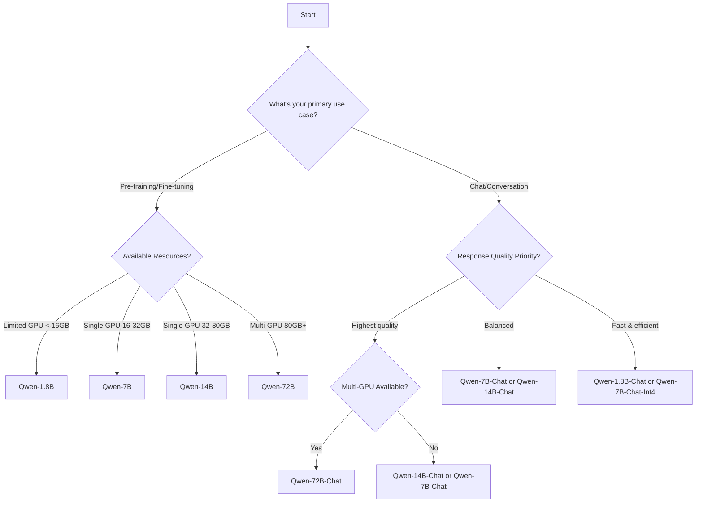

# Model Selection Guide

Selecting the appropriate Qwen model depends on your specific requirements, including task complexity, available compute resources, latency constraints, and budget. This guide helps you make an informed decision.

## Quick Decision Tree

## Model Comparison Matrix

<Tabs>
  <Tab title="Overview">
    | Model | Parameters | Context | Training Tokens | Use Case | Min GPU (Int4) |
    |-------|-----------|---------|-----------------|----------|----------------|
    | Qwen-1.8B | 1.8B | 32K | 2.2T | Edge/mobile, fast inference | 2.9GB |
    | Qwen-7B | 7B | 32K | 2.4T | General purpose, balanced | 8.2GB |
    | Qwen-14B | 14B | 8K | 3.0T | High quality, moderate resources | 13.0GB |
    | Qwen-72B | 72B | 32K | 3.0T | Maximum quality, research | 48.9GB |
  </Tab>
  
  <Tab title="Performance">
    | Model | MMLU | C-Eval | GSM8K | HumanEval | Speed (tok/s, Int4) |
    |-------|------|--------|-------|-----------|---------------------|
    | Qwen-1.8B | 45.3 | 56.1 | 32.3 | 15.2 | 71.07 |
    | Qwen-7B | 58.2 | 63.5 | 51.7 | 29.9 | 50.09 |
    | Qwen-14B | 66.3 | 72.1 | 61.3 | 32.3 | 38.72 |
    | Qwen-72B | 77.4 | 83.3 | 78.9 | 35.4 | 11.32 |
  </Tab>
  
  <Tab title="Memory">
    | Model | BF16 | Int8 | Int4 | Q-LoRA Finetuning |
    |-------|------|------|------|-------------------|
    | Qwen-1.8B | 4.2GB | 3.5GB | 2.9GB | 5.8GB |
    | Qwen-7B | 17.0GB | 11.2GB | 8.2GB | 11.5GB |
    | Qwen-14B | 30.2GB | 18.8GB | 13.0GB | 18.7GB |
    | Qwen-72B | 144.7GB (2×A100) | 81.3GB (2×A100) | 48.9GB | 61.4GB |
  </Tab>
</Tabs>

## Selection by Use Case

### 1. Production Chatbots & Virtual Assistants

<AccordionGroup>
  <Accordion title="High-Traffic Consumer Applications">
    **Recommended**: Qwen-7B-Chat-Int4 or Qwen-14B-Chat-Int4
    
    **Why**:
    - Balanced quality and cost
    - Fast inference speed (~38-50 tokens/s)
    - Fits in single GPU for scalable deployment
    - Strong performance on conversational tasks
    
    **Considerations**:
    - Use Int4 quantization for cost efficiency
    - Deploy with vLLM for higher throughput
    - Consider batching for concurrent users
  </Accordion>
  
  <Accordion title="Enterprise Knowledge Assistants">
    **Recommended**: Qwen-14B-Chat or Qwen-72B-Chat
    
    **Why**:
    - Superior reasoning and comprehension
    - Better handling of complex queries
    - More accurate information retrieval
    - Professional-grade responses
    
    **Considerations**:
    - Fine-tune on domain-specific data
    - Use full precision (BF16) for maximum accuracy
    - Qwen-72B requires multi-GPU setup
  </Accordion>
  
  <Accordion title="Mobile & Edge Applications">
    **Recommended**: Qwen-1.8B-Chat-Int4
    
    **Why**:
    - Smallest memory footprint (2.9GB)
    - Fastest inference speed (71 tokens/s)
    - Can run on consumer hardware
    - Still maintains reasonable performance
    
    **Considerations**:
    - Best for simpler conversations
    - May struggle with complex reasoning
    - Ideal for on-device AI applications
  </Accordion>
</AccordionGroup>

### 2. Code Generation & Programming Assistants

<CardGroup cols={2}>
  <Card title="For Production Code Tools" icon="code">
    **Qwen-14B-Chat** or **Qwen-7B-Chat**
    
    - HumanEval Pass@1: 32.3% (14B), 29.9% (7B)
    - Good balance of speed and accuracy
    - Handles multiple programming languages
    - Suitable for IDE integration
  </Card>
  
  <Card title="For Research & Experimentation" icon="flask">
    **Qwen-72B-Chat**
    
    - HumanEval Pass@1: 35.4%
    - Highest code generation quality
    - Better at understanding complex requirements
    - Ideal for code explanation and debugging
  </Card>
</CardGroup>

### 3. Fine-tuning & Customization

<Tabs>
  <Tab title="Limited Resources">
    **Qwen-1.8B** or **Qwen-7B**
    
    **Recommended Method**: Q-LoRA
    - Qwen-1.8B: 5.8GB GPU memory
    - Qwen-7B: 11.5GB GPU memory
    
    **Ideal For**:
    - Single GPU (RTX 3090, 4090, V100)
    - Domain-specific tasks
    - Fast iteration cycles
    - Budget-conscious projects
    
    **Limitations**:
    - Q-LoRA adapters cannot be merged
    - Slightly slower inference than full fine-tuning
  </Tab>
  
  <Tab title="Moderate Resources">
    **Qwen-7B** or **Qwen-14B**
    
    **Recommended Method**: LoRA or Full Fine-tuning
    - Qwen-7B LoRA: ~20GB GPU memory
    - Qwen-14B LoRA: ~35GB GPU memory
    
    **Ideal For**:
    - A100 40GB/80GB GPUs
    - Production deployments
    - High-quality custom models
    - Tasks requiring new tokens/vocabulary
    
    **Advantages**:
    - LoRA adapters can be merged
    - Better control over model behavior
    - Support for trainable embeddings
  </Tab>
  
  <Tab title="Enterprise Scale">
    **Qwen-14B** or **Qwen-72B**
    
    **Recommended Method**: Full Fine-tuning with DeepSpeed
    - Multi-GPU distributed training
    - DeepSpeed ZeRO 2/3 for memory efficiency
    
    **Ideal For**:
    - Research institutions
    - Large enterprises
    - Maximum customization needs
    - Creating specialized foundation models
    
    **Requirements**:
    - Multiple A100 80GB GPUs
    - High-speed interconnect (NVLink/InfiniBand)
    - Large curated datasets
  </Tab>
</Tabs>

### 4. Mathematical & Scientific Applications

**Performance on GSM8K (Math Word Problems)**:

| Model | Accuracy | Recommended For |
|-------|----------|----------------|
| Qwen-1.8B | 32.3% | Basic calculations, educational apps |
| Qwen-7B | 51.7% | General math assistance, tutoring |
| Qwen-14B | 61.3% | Advanced problem solving |
| Qwen-72B | 78.9% | Research, complex mathematical reasoning |

<Note>
For mathematical applications, Qwen-14B and Qwen-72B show significantly better performance. The 72B model approaches GPT-3.5 level accuracy.
</Note>

### 5. Multilingual Applications

**All Qwen models** support multilingual inference with efficient tokenization:

<Tabs>
  <Tab title="Chinese-English Focus">
    **Any Qwen model** performs well
    
    - C-Eval (Chinese): Qwen-7B scores 63.5 (5-shot)
    - MMLU (English): Qwen-7B scores 58.2 (5-shot)
    - Translation WMT22: Qwen-7B achieves 27.5 BLEU
    
    **Recommendation**: Start with Qwen-7B for balanced bilingual capabilities
  </Tab>
  
  <Tab title="Extended Language Support">
    **Qwen-14B** or **Qwen-72B** for best results
    
    Supported languages with high compression efficiency:
    - East Asian: Japanese, Korean, Vietnamese
    - Middle Eastern: Arabic, Hebrew, Turkish
    - European: Russian, Polish, Dutch, Portuguese, Italian, German, Spanish, French
    
    **Advantage**: 151,851 token vocabulary provides native support without expansion
  </Tab>
</Tabs>

### 6. Long Context Applications

**Context Length Capabilities**:

| Model | Default Context | Extended Context | Best For |
|-------|----------------|------------------|----------|
| Qwen-1.8B | 32K | Up to 32K | Long documents, summarization |
| Qwen-7B | 2048 → 32K | Up to 16K+ | Balanced long-context tasks |
| Qwen-14B | 8K | Up to 8K | Moderate context needs |
| Qwen-72B | 32K | Up to 32K | Maximum context understanding |

<Note>
Long context requires enabling dynamic NTK interpolation and LogN attention scaling. See perplexity benchmarks in the base models documentation.
</Note>

## Hardware Recommendations

### GPU Requirements by Model

<AccordionGroup>
  <Accordion title="Consumer GPUs (RTX 3090, 4090)">
    **24GB VRAM**
    
    **Inference**:
    - ✅ Qwen-1.8B (all precisions)
    - ✅ Qwen-7B-Int4/Int8
    - ⚠️ Qwen-7B-BF16 (tight fit)
    - ❌ Qwen-14B+ (requires quantization or splitting)
    
    **Fine-tuning (Q-LoRA)**:
    - ✅ Qwen-1.8B (5.8GB)
    - ✅ Qwen-7B (11.5GB)
    - ⚠️ Qwen-14B (18.7GB, may need gradient checkpointing)
  </Accordion>
  
  <Accordion title="Datacenter GPUs (A100 40GB)">
    **40GB VRAM**
    
    **Inference**:
    - ✅ Qwen-1.8B, Qwen-7B (all precisions)
    - ✅ Qwen-14B-Int4/Int8
    - ✅ Qwen-14B-BF16 (30GB)
    - ❌ Qwen-72B (requires multi-GPU)
    
    **Fine-tuning (LoRA)**:
    - ✅ Qwen-7B (full precision)
    - ✅ Qwen-14B (with careful configuration)
  </Accordion>
  
  <Accordion title="Datacenter GPUs (A100 80GB)">
    **80GB VRAM**
    
    **Inference**:
    - ✅ All models up to 14B (all precisions)
    - ✅ Qwen-72B-Int4 (48.9GB)
    - ⚠️ Qwen-72B-Int8 (requires 2×GPU)
    
    **Fine-tuning**:
    - ✅ Qwen-7B (full parameter)
    - ✅ Qwen-14B (LoRA/Q-LoRA)
    - ✅ Qwen-72B (Q-LoRA at 61.4GB)
  </Accordion>
  
  <Accordion title="Multi-GPU Setups">
    **2×A100 80GB or better**
    
    **Inference**:
    - ✅ Qwen-72B-BF16 (144GB)
    - ✅ Qwen-72B-Int8 (81GB)
    - ✅ With vLLM: 17.6 tokens/s (BF16)
    
    **Fine-tuning**:
    - ✅ Qwen-14B (full parameter)
    - ✅ Qwen-72B (LoRA with DeepSpeed ZeRO 3)
  </Accordion>
</AccordionGroup>

## Cost-Performance Analysis

### Inference Cost Estimation

Assuming A100 GPU pricing and average utilization:

| Model | Precision | GPU Cost/hr | Throughput | Cost per 1M tokens |
|-------|-----------|-------------|------------|--------------------|
| Qwen-7B-Int4 | Int4 | ~$3 | 50 tok/s | ~$17 |
| Qwen-7B-BF16 | BF16 | ~$3 | 41 tok/s | ~$20 |
| Qwen-14B-Int4 | Int4 | ~$3 | 39 tok/s | ~$21 |
| Qwen-72B-Int4 | Int4 | ~$3 | 11 tok/s | ~$76 |
| Qwen-72B-BF16+vLLM | BF16 | ~$6 (2×GPU) | 18 tok/s | ~$93 |

<Note>
Actual costs vary by cloud provider, region, and negotiated rates. Int4 quantization provides the best cost-performance ratio.
</Note>

## Decision Matrix

### By Primary Constraint

<Tabs>
  <Tab title="Optimize for Quality">
    **Priority**: Best possible outputs, regardless of cost
    
    1. **Qwen-72B-Chat** (BF16) - Maximum quality
    2. **Qwen-14B-Chat** (BF16) - Very high quality, more accessible
    3. **Qwen-7B-Chat** (BF16) - Good quality baseline
    
    **Use Cases**: Research, premium products, critical applications
  </Tab>
  
  <Tab title="Optimize for Speed">
    **Priority**: Lowest latency, fastest response times
    
    1. **Qwen-1.8B-Chat-Int4** - 71 tokens/s
    2. **Qwen-7B-Chat-Int4** - 50 tokens/s
    3. **Qwen-14B-Chat-Int4** - 39 tokens/s
    
    **Use Cases**: Real-time chat, high-traffic APIs, edge deployment
  </Tab>
  
  <Tab title="Optimize for Cost">
    **Priority**: Minimum infrastructure expense
    
    1. **Qwen-1.8B-Chat-Int4** - 2.9GB GPU
    2. **Qwen-7B-Chat-Int4** - 8.2GB GPU
    3. **Qwen-7B-Chat-Int8** - 11.2GB GPU
    
    **Use Cases**: Startups, MVPs, cost-sensitive applications
  </Tab>
  
  <Tab title="Optimize for Balance">
    **Priority**: Best quality-cost-speed trade-off
    
    1. **Qwen-7B-Chat-Int4** - Sweet spot for most applications
    2. **Qwen-14B-Chat-Int4** - Step up in quality, still affordable
    3. **Qwen-7B-Chat-BF16** - Maximum quality in 7B class
    
    **Use Cases**: Most production applications, general-purpose chatbots
  </Tab>
</Tabs>

## Common Scenarios

### Scenario 1: Startup Building a Chatbot MVP

**Requirements**: Fast iteration, low cost, decent quality

**Recommendation**: **Qwen-7B-Chat-Int4**

**Rationale**:
- Fits in single GPU (8.2GB)
- Good performance on benchmarks (MMLU 55.1)
- Fast inference (50 tokens/s)
- Can fine-tune with Q-LoRA on single GPU
- Easy to upgrade to larger model later

### Scenario 2: Enterprise Knowledge Management System

**Requirements**: High accuracy, complex reasoning, domain-specific

**Recommendation**: **Qwen-14B-Chat** fine-tuned on internal data

**Rationale**:
- Strong comprehension (MMLU 64.6)
- Sufficient for enterprise deployment
- Fine-tuning improves domain adaptation
- Reasonable infrastructure cost

### Scenario 3: Research in Long-Form Text Generation

**Requirements**: State-of-the-art quality, long context

**Recommendation**: **Qwen-72B-Chat** with extended context

**Rationale**:
- Best performance across all benchmarks
- 32K context length support
- Comparable to GPT-3.5
- Ideal for research and experimentation

### Scenario 4: Mobile App with On-Device AI

**Requirements**: Extremely low latency, offline capability

**Recommendation**: **Qwen-1.8B-Chat-Int4**

**Rationale**:
- Smallest model (2.9GB)
- Fastest inference (71 tokens/s)
- Can run on mobile GPUs
- Still provides reasonable chat quality

## Migration Path

Many projects benefit from starting small and scaling up:

**Benefits**:
- Lower initial investment
- Faster iteration during development
- Clear upgrade path as needs grow
- Code remains compatible across models

## Final Recommendations

<CardGroup cols={2}>
  <Card title="Most Versatile" icon="star">
    **Qwen-7B-Chat-Int4**
    
    Best all-around choice for production applications. Balances quality, speed, and cost effectively.
  </Card>
  
  <Card title="Best Value" icon="dollar-sign">
    **Qwen-1.8B-Chat-Int4**
    
    Lowest cost option that still delivers reasonable performance. Ideal for high-scale deployment.
  </Card>
  
  <Card title="Highest Quality" icon="trophy">
    **Qwen-72B-Chat**
    
    State-of-the-art results across all benchmarks. Choose when quality is paramount.
  </Card>
  
  <Card title="Fine-tuning" icon="wrench">
    **Qwen-7B (base)**
    
    Best starting point for custom fine-tuning with Q-LoRA on consumer hardware.
  </Card>
</CardGroup>

## Next Steps

<CardGroup cols={3}>
  <Card title="Base Models" icon="book" href="/models/base-models">
    Detailed specifications
  </Card>
  
  <Card title="Chat Models" icon="comments" href="/models/chat-models">
    Chat model capabilities
  </Card>
  
  <Card title="Quickstart" icon="rocket" href="/quickstart">
    Start using Qwen
  </Card>
  
  <Card title="Quantization" icon="compress" href="/optimization/quantization">
    Reduce memory usage
  </Card>
  
  <Card title="Fine-tuning" icon="wrench" href="/fine-tuning/overview">
    Customize models
  </Card>
  
  <Card title="Deployment" icon="server" href="/deployment/overview">
    Deploy to production
  </Card>
</CardGroup>
